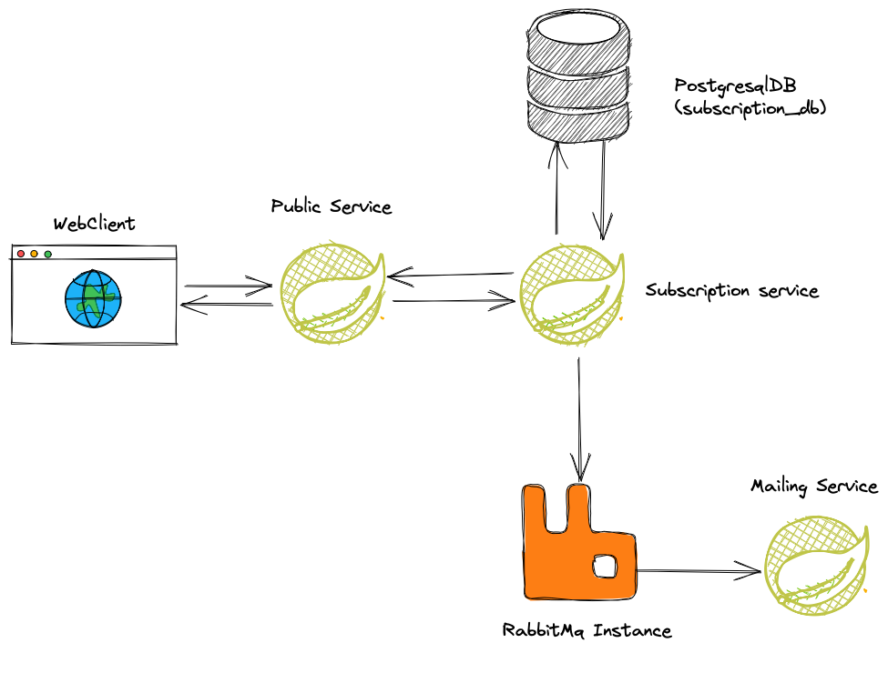
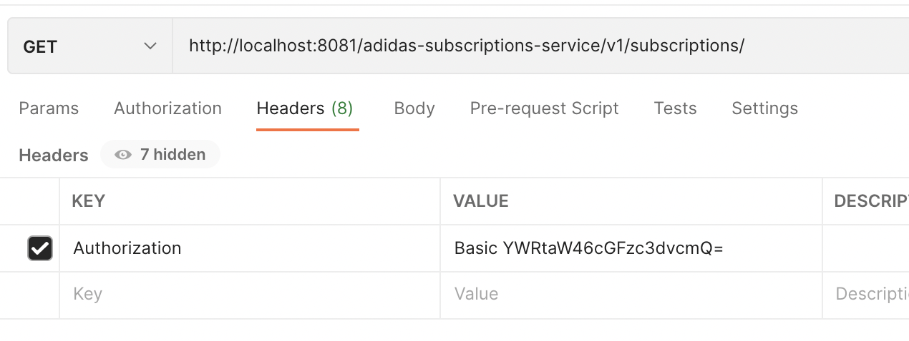

# Adidas Challenge
This app is split into three modules: mailing-service, public-service and subscription-service.
Every module represents a microservice, in the best scenario they would not be in the same parent
project but here let's do it in that way only to make it simple to keep it in GitHub (only one repository).

## Technologies
- Spring ecosystem
- Java17
- RabbitMQ
- Docker
- Docker Compose
- Swagger
- Google Code Style

## Project Structure
```
adidas-challenge
├── README.md
├── build.gradle
├── docker-compose.yml
├── gradle
│   └── wrapper
├── gradlew
├── gradlew.bat
├── mailing-service
│   ├── Dockerfile
│   ├── build
│   ├── build.gradle
│   └── src
├── public-service
│   ├── Dockerfile
│   ├── build
│   ├── build.gradle
│   └── src
├── settings.gradle
└── subscription
├── Dockerfile
├── build
├── build.gradle
└── src
```



### public-service
this module represents the interface between the clients and the intern services. It's not secured
and only exposes the resources which are interesting to the clients, in this case, one endpoint to
subscribe and one endpoint to cancel the subscription.

### subscription-service
This module represents all CRUD operations for a subscription. Delete and Create are called by
`public-service` to realize their operations.
After persists/update (in case of a customer resubscribe to the newsletter) a message is published
at an instance of `rabbitMQ` and consumed by `mailing-service`

This module utilizes spring security to keep it safe, in this example, we are using a simple
`basic in memory authentication` with fixed values. In a real case, we would use JWT + OAuth2.

### mailing-service
It's a console app that fakes mail sending. It consumes messages from a queue in rabbitMQ.
No email is sent, for this example only a message with a link to unsubscribe is shown in the
console.

### Database Structure
```
    Column      |          Type          | Collation | Nullable |                        Default                        
-----------------+------------------------+-----------+----------+------------------------------------------------------
id              | uuid                   |           | not null |                                                       
subscription_id | integer                |           | not null | nextval('subscription_subscription_id_seq'::regclass) 
email           | character varying(200) |           | not null |                                                       
first_name      | character varying(50)  |           |          |                                                       
gender          | character varying(15)  |           |          |                                                       
birth_date      | date                   |           | not null |                                                       
active          | boolean                |           | not null |                                                       
campaign_id     | integer                |           | not null |                                                       
```

It's simple database, contains only one table to store the subscriptions. Campaing would be a foreign_key to another table that was not described for this challenge.
The exclusions are logic: we only apply false to the column `active`.

## Running the project
It's all modules are containerized and can be built simply using the docker-compose file in the
the root of the project.
If you have docker-compose installed on your computer you can open your terminal inside the project folder and type `docker-compose up`.
I suggest you do not use `-d` option, its interesting to see the logs, especially from the `mailing service`.

Running from the first time can take a while, docker will download all images and after that, all containers will download the dependencies and for sure it will take a few minutes.

After starting, you can read the documentation made by swagger for the two APIs using the following links: \
(public-service) http://localhost:8080/v1/swagger-ui/index.html \
(subscription-service) http://localhost:8081/v1/swagger-ui/index.html 

I recommend you to use a client like Postman or Insomnia since you have to pass an authorization token with the headers.
You can see how to call the API using a basic auth in the picture(token `Basic YWRtaW46cGFzc3dvcmQ=`)



After creating a new subscription, you will see at console a message like the following:
`Hello, thanks for your subscription. To unsubscribe click on this link: http://localhost:8080/adidas-public-service/v1/subscriptions/delete/c1889a20-bdb3-485d-83f3-42725ae84be8`
This message is just a fake text for an email but the link really works to cancel the subscription.


